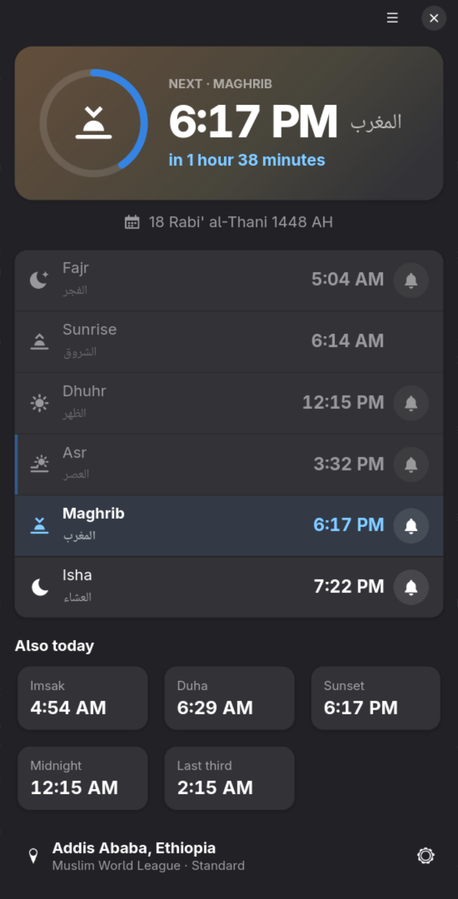
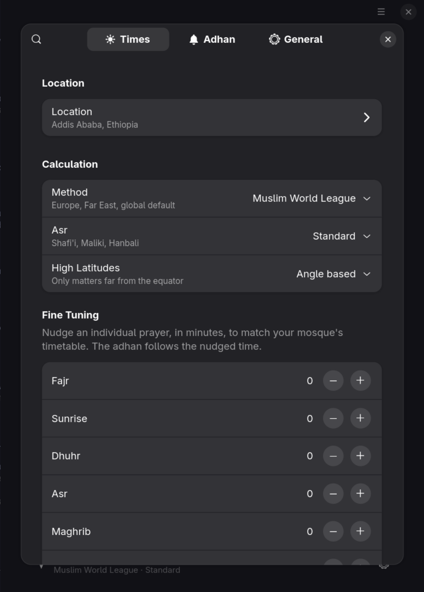
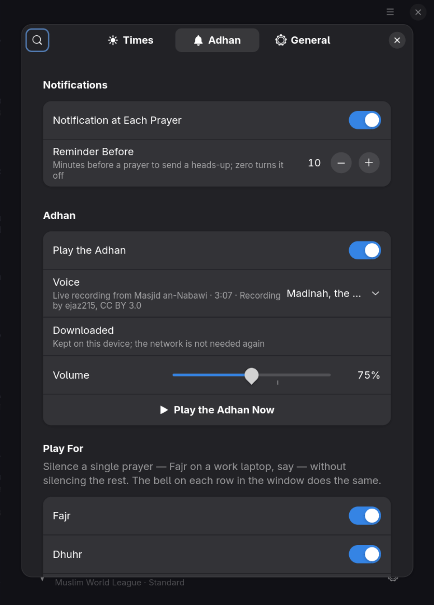

# Salah

[](https://github.com/sifenfisaha/salah/actions/workflows/ci.yml)
[](LICENSE)

Prayer times and the adhan, for the GNOME desktop.



Salah shows the next prayer with a live countdown and a ring through the
current window, every prayer with its Arabic name, the Hijri date, and the
derived times that no timetable prints but everyone eventually wants — Imsak,
Duha, Islamic midnight, and the last third of the night. At each prayer you
get a notification and, unless you have turned it off for that prayer, the
adhan.

It is the GNOME sibling of the
[Omarchy plugin](https://github.com/sifenfisaha/omarchy-salah-reminder) and
shares its engine: the same solar model, the same sixteen calculation
methods, and the same golden-value tests.

## Install

### Flatpak

A Flathub listing is planned. Until it lands, build the Flatpak from this
repository — it needs the GNOME 49 runtime and SDK:

```bash
flatpak install flathub org.gnome.Platform//49 org.gnome.Sdk//49
flatpak-builder --user --install --force-clean _flatpak io.github.sifenfisaha.Salah.json
flatpak run io.github.sifenfisaha.Salah
```

### From source

Salah is a GJS application, so there is nothing to compile; meson installs
the scripts, the resources, the schema and the icons.

| Needs | Version | Debian / Ubuntu | Fedora | Arch |
| --- | --- | --- | --- | --- |
| gjs | ≥ 1.76 | `gjs` | `gjs` | `gjs` |
| GTK | ≥ 4.14 | `libgtk-4-1` | `gtk4` | `gtk4` |
| libadwaita | ≥ 1.8 | `libadwaita-1-0` | `libadwaita` | `libadwaita` |
| GStreamer + base and good plugins | ≥ 1.20 | `gstreamer1.0-plugins-base gstreamer1.0-plugins-good` | `gstreamer1-plugins-base gstreamer1-plugins-good` | `gst-plugins-base gst-plugins-good` |
| libsoup | 3 | `libsoup-3.0-0` | `libsoup3` | `libsoup3` |
| libportal | optional | `libportal-gtk4-1` | `libportal-gtk4` | `libportal-gtk4` |
| meson, ninja, gettext, desktop-file-utils, appstream | build only | | | |

```bash
meson setup _build --prefix=/usr
meson compile -C _build
sudo meson install -C _build
```

Use `--prefix=$HOME/.local` for an install that needs no root; GNOME finds
applications, icons and schemas there as long as `~/.local/share` is on
`XDG_DATA_DIRS`, which it is on every current distribution.

Without libportal, "Use system location" is not offered and starting at
login is arranged by writing an autostart entry directly rather than through
the portal. Everything else is the same.

### Removing it

```bash
sudo ninja -C _build uninstall        # or: flatpak uninstall io.github.sifenfisaha.Salah
rm -rf ~/.local/share/io.github.sifenfisaha.Salah ~/.local/state/io.github.sifenfisaha.Salah
rm -f ~/.config/autostart/io.github.sifenfisaha.Salah.desktop
gsettings reset-recursively io.github.sifenfisaha.Salah
```

The first directory holds downloaded recordings, the second the state files
described below, and the settings live in dconf. Salah writes nowhere else.

## Where it gets your location

Nothing is looked up until you ask. The location dialog offers three ways,
and says which service each one talks to:

1. **A city search**, with live suggestions from
   [Open-Meteo's geocoder](https://open-meteo.com/en/docs/geocoding-api).
2. **The system location service**, through the location portal. On GNOME
   this is GeoClue, and the desktop asks you before answering.
3. **An IP lookup** against [ipapi.co](https://ipapi.co/), which is
   approximate but needs no permission.

The coordinates are then stored and everything is computed on your device.
With a location set, the Hijri correction off, and the bundled voice chosen,
Salah never touches the network at all.

## Calculation



Sixteen methods, all selectable in preferences: Muslim World League, Egyptian
General Authority, Umm al-Qura, Karachi, ISNA, Moonsighting Committee,
Diyanet, Singapore, the Gulf authorities, UOIF, Russia, Tehran, and Jafari.
Asr follows either the standard (Shafi'i, Maliki, Hanbali) or the Hanafi
shadow ratio.

Times are computed locally from the solar position — no account, no API, and
it keeps working on a plane. The engine implements the PrayTimes model, which
is what Aladhan and most published timetables derive from.

**Accuracy.** Checked against `api.aladhan.com` across five cities, three
seasons, seven methods and both madhabs — 42/42 exact for Addis Ababa, and
every remaining difference elsewhere is a single minute on a value that sits
within seconds of a minute boundary, where Aladhan and `adhan-js` disagree
with each other by more than either disagrees with this. `meson test` pins
the behaviour with golden values.

If your mosque prints something slightly different, **Fine tuning** in the
preferences nudges any prayer by up to an hour, and that offset is what the
adhan uses too.

### High latitudes

Above roughly 48° the sun stops dipping far enough below the horizon for Fajr
and Isha to have a true angle for part of the year. Four rules are offered;
*Angle based* is the default and matches what most apps do. *None* reports
such a night honestly, with no Fajr or Isha rather than an invented one.

## The adhan



At each prayer you get a notification and, unless you have turned it off for
that prayer, the adhan. The bell on each row in the window toggles that
prayer on its own — Fajr silent on a work laptop, the rest audible, say. A
reminder a chosen number of minutes before each prayer is on by default and
can be turned off.

The default voice is a live recording of the adhan from the Prophet's Mosque
in Madinah. It is not bundled: the first time Salah runs it is fetched from
Wikimedia Commons, 2.8 MB, into `~/.local/share/io.github.sifenfisaha.Salah/adhan/`
and kept, and until it has arrived a 42-second CC0 recording that ships with
the app plays instead. **Voice** in the preferences offers others, fetched
the same way the first time they are chosen: a live recording from Masjid
al-Haram in Makkah, a studio recitation by Aaqib Azeez, a mosque recording
from Nigeria, and the bundled recording itself for an app that never touches
the network. Every one carries a free licence, and the credit it asks for is
shown under the setting, in the About dialog, and in [NOTICE.md](NOTICE.md).

Recordings by the muezzins people ask for by name are copyrighted, so a free
app cannot ship them. Pick **A file of your own** and point it at anything
GStreamer can play instead.

A prayer whose moment passed while the machine was suspended is skipped
rather than fired on resume, and one that was already announced is never
announced twice, even across a restart.

## Hijri date

The window shows the Hijri date from an arithmetic calendar, which drifts a
day against Umm al-Qura for stretches of several months. Left on, **Correct
against Umm al-Qura** checks once a day and remembers the correction, so the
date stays right afterwards even offline. Turn it off for a fully offline app
and use the manual shift instead.

Months begin on a local sighting, so mosques in one city can legitimately
differ by a day. The shift is there for that. Switching the correction off
also forgets whatever it had learned, so the shift you set is the whole
shift.

## Running in the background

The adhan is only useful if it sounds when the window is closed, so **Run in
the background** is on by default: closing the window leaves Salah running,
and it asks to be started at login. On GNOME that request goes through the
background portal, which is also what a Flatpak has to use; elsewhere Salah
writes the autostart entry itself. Turn the setting off under Preferences ›
General to get a plain app that quits with its window.

## Command line and scripting

Salah is a normal `GApplication`, so its actions are reachable from the shell
and from keyboard shortcuts of your own:

```bash
io.github.sifenfisaha.Salah --background         # start with no window
io.github.sifenfisaha.Salah --version

gapplication action io.github.sifenfisaha.Salah play          # play the adhan now
gapplication action io.github.sifenfisaha.Salah stop          # stop it
gapplication action io.github.sifenfisaha.Salah show          # open the window
gapplication action io.github.sifenfisaha.Salah location      # the location dialog
gapplication action io.github.sifenfisaha.Salah preferences
gapplication action io.github.sifenfisaha.Salah preferences-page "'adhan'"   # times, adhan or general
gapplication action io.github.sifenfisaha.Salah sync-hijri    # re-check the Hijri date now
gapplication action io.github.sifenfisaha.Salah quit
```

Today's table is written to
`~/.local/state/io.github.sifenfisaha.Salah/state.json` once a minute, as ISO
timestamps, for scripts and panels that want it without reimplementing the
astronomy. Next to it, `announced.json` records which prayers have already
been announced, by day and minute, so a restart never plays an adhan twice,
and a prayer whose time you nudge after it sounded is announced again at the
new time.

## Settings

Everything in the preferences is a GSettings key under
`io.github.sifenfisaha.Salah`, so `gsettings`, dconf-editor and the window
all see the same value the moment it changes.

| Key | Meaning |
| --- | --- |
| `has-location`, `location-name`, `latitude`, `longitude` | Where you are; nothing is computed until `has-location` is true |
| `method` | `mwl`, `egypt`, `makkah`, `karachi`, `isna`, `moonsighting`, `turkey`, `singapore`, `gulf`, `dubai`, `kuwait`, `qatar`, `france`, `russia`, `tehran`, `jafari` |
| `madhab` | `standard` or `hanafi` |
| `high-latitudes` | `angle-based`, `night-middle`, `one-seventh`, `none` |
| `tune-fajr` … `tune-isha` | Per-prayer correction in minutes, −60 to 60 |
| `notifications`, `reminder-minutes` | The notification at each prayer, and the heads-up before it; `0` disables the reminder |
| `play-adhan`, `adhan-fajr` … `adhan-isha` | The adhan overall, and per prayer |
| `voice` | `madinah` (default), `makkah`, `aaqib-azeez`, `nigeria`, `bundled`, or `custom`, which plays `custom-adhan-file` |
| `volume` | Percent; above 100 amplifies |
| `hijri-sync`, `hijri-offset`, `hijri-auto-offset` | The daily correction, your own shift, and the correction it learned |
| `clock-format` | `system`, `24h` or `12h` |
| `show-seconds` | Seconds in the countdown |
| `run-in-background` | Keep running with the window closed, and start at login |

## Layout

```
meson.build                           the build: schema, resources, icons, translations, tests
io.github.sifenfisaha.Salah.json      the Flatpak manifest
data/                                 desktop entry, AppStream metadata, GSettings schema, icons, UI templates, stylesheet
src/main.js                           entry point
src/application.js                    the application: actions, the background hold, About
src/engine/                           pure ES modules, no GNOME imports: the astronomy, the Hijri calendar, the voice catalogue, the day model
src/services/                         what acts: the announcer, playback, notifications, downloads, location lookups, autostart
src/ui/                               the window, the preferences, the location dialog, the ring, a prayer row
test/                                 golden-value tests for the engine, run by node
po/                                   translations
docs/                                 screenshots and ARCHITECTURE.md
```

The engine never imports anything from GNOME, which is what lets `npm test`
run it directly under node and keeps the same code shared with the Omarchy plugin.

## Contributing

Bug reports, fixes, new calculation methods, translations and better wording
are all welcome. [CONTRIBUTING.md](CONTRIBUTING.md) covers running your own
copy, the checks to run, and the conventions;
[docs/ARCHITECTURE.md](docs/ARCHITECTURE.md) explains how the pieces fit and
lists the GJS and meson behaviours that have bitten this code before. The
short version:

```bash
git clone https://github.com/sifenfisaha/salah.git && cd salah
meson setup _build
meson compile -C _build
meson devenv -C _build io.github.sifenfisaha.Salah    # run from the build tree
meson test -C _build                                  # schema, desktop file, AppStream, engine
```

Changes are listed in [CHANGELOG.md](CHANGELOG.md).

## Licence

MIT, except the bundled recording and the icons' Adwaita heritage — see
[NOTICE.md](NOTICE.md).
